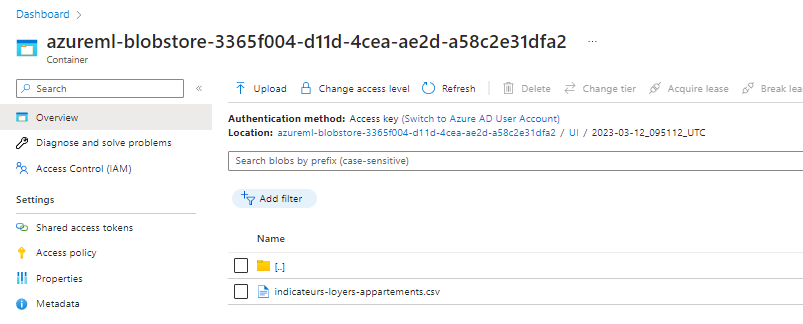

# Data and Storage

## Introduction
In this part we'll talk about how to use Data in AzureML.


## Directly in the code
We won't talk about this functionnality because it was done in the azure overview.

Basically, we'll upload the data file directly in the code.


## Use Managed File Dataset
The file dataset is a way to upload data in AzureML.
For that, you can go to the **Data** tab of AzureML.

For the example, we'll use the CLI v1.

Let's create a new dataset:


Upload a new file :


Bellow the hood, the file is copied in the default datastore.



In order to consume the file, there is two way.
Let's investigate it :
<div style="background-color:#0000EE22">
IN AZUREML WORKSPACE<br>
</div>

```python
# azureml-core of version 1.0.72 or higher is required
from azureml.core import Workspace, Dataset
import pandas as pd
import os

workspace = Workspace.from_config()

dataset = Dataset.get_by_name(workspace, name='Immo_Data')

with dataset.mount() as mount_context:
    print(mount_context.mount_point)
    path = os.path.join(mount_context.mount_point,'indicateurs-loyers-appartements.csv')
    df = pd.read_csv(path,sep=';',decimal=',')
```

The second way is to download the dataset :
```python
# azureml-core of version 1.0.72 or higher is required
from azureml.core import Workspace, Dataset
import pandas as pd

workspace = Workspace.from_config()
dataset = Dataset.get_by_name(workspace, name='Immo_Data')
path = dataset.download(target_path='.', overwrite=True)

df = pd.read_csv(path[0],sep=';',decimal=',')
```

As you can see, when you use dataset.download() the file is downloaded in your environment, then you don't see the interest compared to manually upload in the code....
I think you'll understand when we'll talk about **Pipelines**.


## External Storage Source
Often, your data will be consumed from an external storage source.
But before doing this, we'll have to focus a little on how to upload data on such storage !

For that, we'll play with MNIST dataset, in order to do it.
### Upload data to a storage
In order to perform this operation, we'll use **azure blob sdk**.
There is documentation about how to use it there :
[>> Azure Blob SDK](https://michelingroup.sharepoint.com/sites/ExplorationManufacturing/SitePages/AzureStorage_SDK.aspx)

<div style="background-color:#00EE0022">
RUN ON YOUR COMPUTER<br>
</div>

```bash
# We'll install torchvision in order to download MNIST dataset
# No GPU support required...
> conda create -n azml_training python=3.8 openssl=1.1.1n
> pip install notebook ipykernel tqdm pillow
> pip install  torchvision --extra-index-url https://download.pytorch.org/whl/cpu
> pip install azure-storage-blob python-certifi-win32
> touch download_MNIST.ipynb
```

<div style="background-color:#00EE0022">IN THE NOTEBOOK</div>

```python
# Cell 1
%%capture
import os
os.makedirs('../data',exist_ok=True)
import torchvision
mnist_train = torchvision.datasets.MNIST(root = "../data",train = True,download=True)
```

```python
# Cell 2
import numpy as np
from tqdm import tqdm

NMAX = 1000 # We'll keep 1000 images per classes
NClasses = len(mnist_train.classes)

indices = np.arange(len(mnist_train))
np.random.shuffle(indices)
selection = {clsName:[] for clsName in mnist_train.classes}
for i in tqdm(indices):
    img_pil,clsID = mnist_train[i]
    clsName = mnist_train.classes[clsID]
    if len(selection[clsName])<NMAX:
        # We convert in RGB (optionnal)
        selection[clsName].append(img_pil.convert('RGB')) 
    if sum([len(indices) for indices in selection.values()])==NMAX*NClasses:
        print('Selection Completed !')
        break
```

```python
# Cell 3
import shutil
import os
from PIL import Image as PIL_Image

# We'll save images in a directory with class as name.
destination_root = "./data/MNIST_FLAT/"
shutil.rmtree(destination_root,ignore_errors=True)
os.makedirs(destination_root,exist_ok=True)
for clsName in selection:
    dest_dir = os.path.join(destination_root,clsName)
    os.makedirs(dest_dir,exist_ok=True)
    images = selection[clsName]
    for i,img in tqdm(enumerate(images),total=len(images)):
        im_name = f"{clsName}_{i}.jpg"
        im_path = os.path.join(dest_dir,im_name)
        img:PIL_Image
        img.save(im_path)
```

Next step, we'll need to create the upload script. For that we'll write a script that will iterate on your local directory and upload files to a distant blob storage.

```python
# Cell 4
from azure.storage.blob import ContainerClient
connection_string = "<CONNECTION_STRING>"
container_name = "<CONTAINER NAME>"
container_client = ContainerClient.from_connection_string(connection_string,container_name)

assert container_client.exists()

for clsName in selection:
    im_dir = os.path.join(destination_root,clsName)
    tbar = tqdm(os.listdir(im_dir))
    for imgName in tbar:
        imgRelativePath = os.path.join(clsName,imgName)
        imgPath = os.path.join(destination_root,imgRelativePath)
        with open(imgPath,'rb') as img_data:
            container_client.upload_blob(
                name=imgRelativePath,
                data=img_data,
                overwrite=True)
        tbar.set_postfix_str(f'Image {imgRelativePath}')


```
In order to upload data, we'll first have to create a container and get the connection string. 

Azure Ressource Group>> Storage ending with **data**<br>
Create a new container **mnist-data**


Replace **\<CONTAINER NAME>** by **mnist-data** in your notebook cell.

Go back to the storage account, and get it's **connection string.**


Replace **\<CONNECTION STRING>** in your notebook cell.<br>
Launch the cell and wait for completion...


Once it is done, you'll be able to see your data in your azure storage container.


Now, we are ready to go back in AzureML !

# Consume your data

## AzureML SDK -Link the storage with AzureML
For that, we'll go back in the **Data** tab of our AzureML.<br>


Click on **Create** button in order to add our containers.<br>


You will need the account key in order to be able to view your data.<br>
If the configuration is successfull, you'll be able to see your folder in the preview.<br>


### Consume our datastore
In order to consume our datastore, we'll write the code bellow :<br>

<div style="background-color:#0000EE22">
IN AZUREML WORKSPACE<br>
</div>

```python
# azureml-core of version 1.0.72 or higher is required
from azureml.core import Workspace, Datastore,Dataset

workspace = Workspace.from_config()

datastore = Datastore.get(workspace, 'mnist_data')
# We put in a list because we can mount more than one datastore at the same time. [(datastore, '/**'),(datastore_labels,'/**')]
dataset_paths=[(datastore, '/**')]  
dataset = Dataset.File.from_files(path=dataset_paths)
path = dataset.mount()
with dataset.mount() as mount_context:
    print(mount_context.mount_point)
    # WARNING ! 
    # In case we mount 2 different datastore at the same time...
    # There will be 2 directories in mount point correspondng to the two datastore.
    #################################################################
    # You can try by cloning the mnist_data in another container and mounting both...
    clsNames = os.listdir(mount_context.mount_point)


print(clsNames)
```

As a result, you should be able to see your classes.

## BlobFuse2 - Mount your storage
Create a **blobfuse2** directory in your arborescence.
Under this directory, create a **00_install.sh** file.

<div style="background-color:#0000EE22">
IN AZUREML WORKSPACE - 00_install.sh<br>
</div>

```bash
# Install repository
wget https://packages.microsoft.com/config/ubuntu/20.04/packages-microsoft-prod.deb
sudo dpkg -i packages-microsoft-prod.deb
sudo apt-get update
# Install dependancies
sudo apt-get install libfuse3-dev fuse3
# Install Blobfuse2
sudo apt install blobfuse2
```

Run this script with this command in a terminal...
```bash
# Install repository
sh blobfuse2/00_install.sh 
```

Create a **config** dir inside blobfuse and a file **mnist_data** in it.

<div style="background-color:#0000EE22">
IN AZUREML WORKSPACE - config/mnist_data.yaml<br>
</div>

```yaml
# Refer ./setup/baseConfig.yaml for full set of config parameters
allow-other: true

logging:
  type: syslog
  level: log_debug

components:
  - libfuse
  - file_cache
  - attr_cache
  - azstorage

libfuse:
  attribute-expiration-sec: 120
  entry-expiration-sec: 120
  negative-entry-expiration-sec: 240

file_cache:
  # Define the cache size / place
  path: /tmp/.azcache
  timeout-sec: 120
  max-size-mb: 512

attr_cache:
  timeout-sec: 7200

azstorage:
  type: block
  # Enable virtual directory => Important to discover well files
  virtual-directory : true
  account-name: <STORAGE NAME>
  endpoint: https://<STORAGE NAME>.blob.core.windows.net
  # mode possible : key|sas|spn|msi
  mode: key
  account-key: <ACCOUNTKEY>

mountall:
  # allowlist takes precedence over denylist in case of conflicts
  container-allowlist:
    - mnist-data


```

Of course, replace your storage account_name / container_name / endpoint and account key to be the one corresponding to your storage.

Once done, create a **01_mount.sh** and a **02_umount.sh** script :
<div style="background-color:#0000EE22">
IN AZUREML WORKSPACE - 01_mount.sh<br>
</div>

```bash
sudo mkdir /media/aml_data
sudo mkdir /tmp/.azcache
# Replace myuser by your user, in my case f296849
sudo chown azureuser /media/aml_data
sudo chown azureuser /tmp/.azcache
sudo blobfuse2 mount all /media/aml_data/ --config-file="/home/azureuser/cloudfiles/code/Users/francois.ponchon/blobfuse2/config/mnist_data.yaml"
```

<div style="background-color:#0000EE22">
IN AZUREML WORKSPACE - 02_umount.sh<br>
</div>

```bash
# Unmount All
sudo blobfuse2 unmount all
```

The arborescence should look like that :


Run mount.sh script
```bash
# Install repository
sh blobfuse2/01_mount.sh 
```
Let's try it :
```bash
# create a new file in mnist_data...
touch /media/aml_data/mnist-data/my_test 
# list all file in /media...
tree -L 3 /media/
```


We can see that :
- we have mount our storage
- we have a read/write access to the datastore !


---
[<< Back](../README.md)